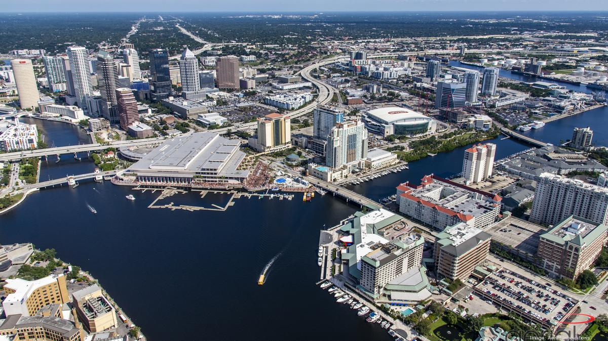

# Tampa Bay Attractions

<b>SSDBM 2021 will be an online event</b> with no physical meeting taking place.

 

The City of Tampa is at the center of a series of cities that are collectively referred to as the Tampa Bay Area. With its mixture of historical landmarks and modern architecture, vibrant buiness districts and entertainment sites, beautiful waterways and dazzling beaches, Tampa Bay is a major tourism destination in US that attracts more than 22 million visitors annually. 

The area is full of attractions for visitors of all ages and tastes.  Busch Gardens is an African-themed amusement park with thrill rides and animal-viewing areas. Besides Busch Gardens, animal attractions include Lowry Park Zoo and two aquariums, with shark exhibits, a coral reef, and home to dolphin film stars Winter and Hope. Popular nearby beaches include Clearwater Beach, Treasure Island Beach and those at Caladesi Island State Park, which are reachable by boat. Tampa is also known for its museums and other cultural offerings. The historic Ybor City neighborhood, developed by Cuban and Spanish cigar-factory workers at the turn of the 20th century, is a dining and nightlife destination. The postmodern Tampa Museum of Art exhibits modern and ancient art, and the Museum of Science and Industry offers an IMAX theater. The Dali Museum hosts the largest collection of the works of Salvador Dali outside Europe. The Henry B. Plant Museum preserves a Gilded Age railroad tycoon’s ornate, Moorish-style hotel. Major-league sports teams are football’s Buccaneers, hockey’s Lightning, and baseball’s Rays. 

You can find even more attractions of Tampa [here](https://www.visittampabay.com/things-to-do/tampa-attractions/).
